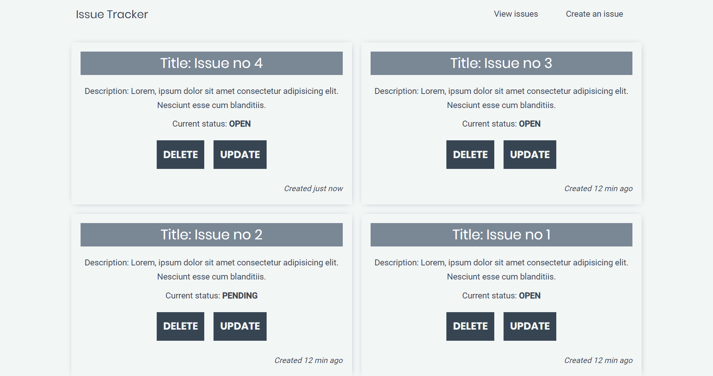

<p align="center">
  <a href="#">
    
  </a>
</p>
<h1 align="center">
  Issue Tracker
</h1>

## Installation

To install the app:

```js
git clone https://github.com/jsberlanga/issue-tracker.git
```

Then cd into server and client folders and install the dependencies.

## Usage

To run the app:

```js
cd client
npm run app
```

Then go to http://localhost:3000/ to see the issue tracker app.
